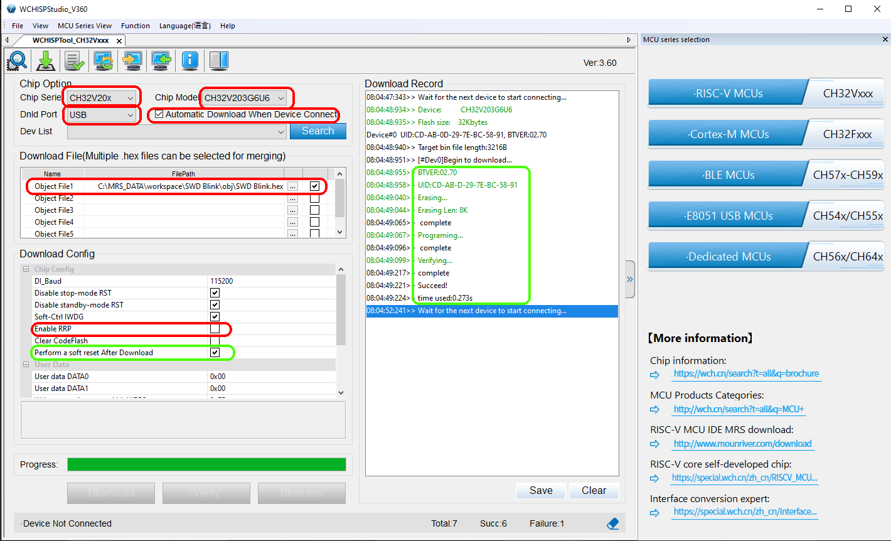
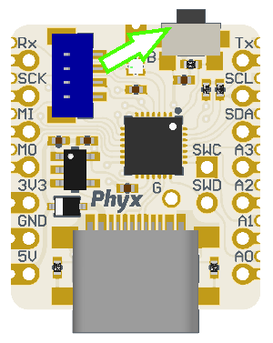

# Preparation 
This needs to be done only one time.

1) Download WCHISPTool_Setup.exe
https://www.wch-ic.com/downloads/WCHISPTool_Setup_exe.html
2) Install wCHISPTool_Setup.exe
3) Download the LANA EOL Firmware
https://github.com/area3001/Lana/tree/EndOfLine/EndOfLine/Firmware/Binaries

Note: use LANA_EOL_G8.hex for the 64k version of LANA (CH32V 203 G8U6)

# Flashing
1) Start WCHISPTool
2) Select RiskV MCU's / CH32Vxxx
3) Set these options
	1. Chip Serie: CH32V20x
	2. Chip Model: CH32V203G8U6 or CH32V203G6U6 (depending on the chip used)
	3. [v] Automatic Download When Device Connect
	4. Object File 1: **Select the hex file you downloaded above**
    5. Enable RRP: This must be off, do not enable.
    6. Perform a soft reset After Download: [v] this must be on

## For each LANA Chip
1) press, and HOLD the boot button  

2) insert the usb connector while still holding the boot button
3) The download record should show Succeed!
4) The onboard LED starts blinking in a rainbow pattern

