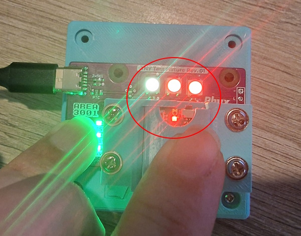

# LANA EOL TEST v 1.0
> for latest version of this document visit: https://github.com/area3001/Lana/blob/main/EndOfLine/EOL_testing_lana.pdf

# How to test
1) put the board in the test fixture like in the picture.   
   
2) Put on the cover
   
3) Press the cover and the black test button
   
   1) If all LEDS are green the test was OK
   2) If leds are not GREEN check the error codes below
      
	  In this example we get code YELLOW RED RED. This means the PA3 or PA5 pin is not well connected

	   
# Error codes

Pins are connected and  tested in pairs. We test if pairs are shorted to ground, vcc if their connection to the pad of the PCB works and if there are internal shorts between pins. If all tests for all pairs works you see 3 green LEDS 🟢🟢🟢. If you see any other color then the board has an issue. 

| LEDS | Meaning |
| --- | --- |
|  | ALL Tests OK without error |
|  | Short VCC |
|  | Short GND |
|  | (PA3, PA5) Not connected |
|  | (PA6, PB7)  Not connected |
|  | (PA2, PB6) Not connected |
|  | (PB0, PB1) Not connected |
|  | (PA0, PA14) Not connected |
|  | (PA1, PA13) Not connected |
|  | Shorts between pins |

